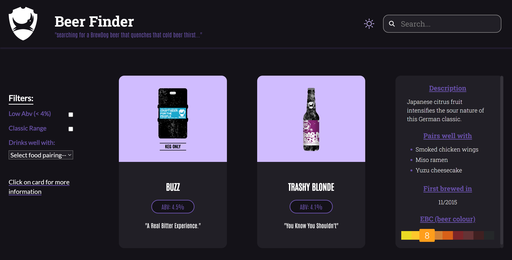

# BEER FINDER APP

Tasked with building a Single-Page App with REACT.JS that utilises BrewDog's PUNK Api

VISIT:  https://tonylubin.github.io/Beer-Finder-Punk-api

# Outcomes: #

(1) ability to search for beers via name/letter and page will update while user types each letter  
(2) can filter content on 3 conditions:   
    - Low Alcohol (ABV value less than or equal to 4%)  
    - Classic Range (was first brewed before 2010)  
    - Drop down menu for food pairing based on array of keywords
(3) demonstrate how to read Api's documentation and use it inside the project & manipulate data

# Design/Display: # 

- mobile first design - viewable across mobile, tablet & laptop
- light and dark theme - using the html `data-*` attribute to target all html elements with css variables for colour scheme
- Created a beer finder app that displays the beers on the web page in a card format using CSS Grid
- applied a hover css styling option to flip card for more information
- styled using SASS, css modules and utilised BEM convention
- Fixed postion Header that hides main section of beers when scrolling
- Navigation bar that has a fixed position to enable actions (filtering) to be performed by user whilst scrolling
- beer colour scale chart --> used JS switch statement to highlight beer colour with conditional css classes. 

# Functions: #

- using FETCH with async/await to get data from Api
- utilised Api endpoints and parameters in a 'data service file' (external to component to keep it simple) for the search function and filtering options'
  - URL structure so that filtering is done accordingly by building upon API endpoints in a fetch request e.g: 
  base url = `https://api.punkapi.com/v2/beers?page=1` 
  search input e.g. `&beer_name=${searchTerm}` 
  filter options are added e.g. `&abv_lt=5`, `&brewed_before=01-2010` 
  Used array methods `push` & `join` for API URL request with search input at `index[0]` so that "High Alcohol" filter happens on search input result only i.e. on beers search input with "pils" only beers that contain letters "pils" and not on the whole catalogue of beers. 
  e.g. `https://api.punkapi.com/v2/beers?page=1&beer_name=pils&abv_lt=5`
- search bar (input) that updates beers to be displayed
- 2 x checkboxes that use a setState to filter beer data via set condition(s)
- using JS array functions (`map, filter, some, includes`) for nested arrays to apply food filter to dataset
- `react-query` - package for data storing & filtering data
- `react-intersection-observer` with `react-query` - to enable inifinte scrolling combined with pagination results/queries from Api.
- `react-loader-spinner"` - loading spinners for animation of data loading & fetching next api page of results 
- unit tested, using JEST/ENZYME

# SCREENSHOTS #

 

# RUN: #
- clone down repo
- `npm install`
- `npm start`
